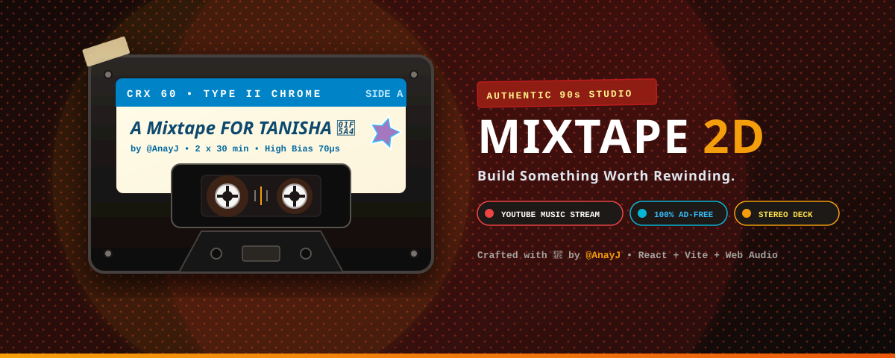

<div align="center">



# 📼 MIXTAPE 2D
### *Build Something Worth Rewinding.*

[](https://reactjs.org/)
[](https://vitejs.dev/)
[](https://tailwindcss.com/)
[](https://developer.mozilla.org/en-US/docs/Web/API/Web_Audio_API)
[](https://music.youtube.com/)
[](https://vercel.com/)
[](LICENSE)

<p align="center">
  <b>An authentic, skeuomorphic 90s Cassette Deck & J-Card Studio with ad-free YouTube Music background streaming, tactile hardware controls, real-time VU needle ballistics, and handwritten mixtape customization.</b>
</p>

[✨ Live Demo](#-getting-started) • [⚡ Highlights](#-highlights) • [🕹️ Hardware Specs](#-skeuomorphic-cassette-deck-specs) • [🚀 Deploy to Vercel](#-deploy-to-vercel)

---

</div>

```
 ____________________________________________________________________
|  ________________________________________________________________  |
| | [=] WERK STEREO CASSETTE DECK                     DOLBY B-NR   | |
| |----------------------------------------------------------------| |
| |  [ SIDE A ]  Vishal-Shekhar — Tera Rastaa Chhodoon Na          | |
| |  Track 1 of 5 • 4:13                                           | |
| |  VU L: [||||||||||||....]  VU R: [|||||||||||.....]   03:42    | |
| |________________________________________________________________| |
|       _____                                             _____      |
|      /     \   =====================================   /     \     |
|     |  (O)  |  |  :::  100 .... 50 .... 0  [PLAY]  |  |  (O)  |    |
|      \_____/   =====================================   \_____/     |
|____________________________________________________________________|
  [⏪ REW]  [▶ PLAY]  [⏸ PAUSE]  [⏹ STOP]  [⏩ FF]  [⏏ EJECT]  [🔀 FLIP]
```

---

## ⚡ Highlights

<table>
<tr>
<td width="50%">

### 🎵 Ad-Free YouTube Music Engine
- **Full Song Playback**: Streams complete tracks programmatically via an integrated background player with zero ad interruptions.
- **Open Global Search**: Instantly searches millions of songs, albums, and artists via open YouTube Music endpoints.
- **Direct Link Importer**: Paste any `music.youtube.com`, `youtube.com/watch?v=...`, or `youtu.be` URL.

</td>
<td width="50%">

### 📻 Skeuomorphic Cassette Hardware
- **Dynamic Tape Physics**: Spinning spools with physical magnetic ribbon that dynamically grows on the take-up reel and shrinks on the supply reel.
- **Tactile Audio Deck**: Mechanical click sounds, motor rewind/fast-forward whirrs, tape hiss generator, and authentic Dolby B-NR filter.
- **Dual VU Meter Modes**: Switch between analog dual-needle ballistics and cyber cyan LCD frequency bars.

</td>
</tr>
<tr>
<td width="50%">

### 🎨 Unfolded 3-Panel J-Card Studio
- **Handwritten Typography**: Authentic handwriting styles (*Patrick Hand*, *Walter Turncoat*, *Caveat*, *Kalam*, *Covered By Your Grace*).
- **Physical Paper Textures**: Vintage matte cardstock, lined ledger paper, halftone patterns, and torn masking tape aesthetics.
- **Real-Time Capacity Bars**: Visual running time gauges ensuring you never exceed your tape's physical side limit (`C-30`, `C-40`, `C-46`, `C-60`, `C-90`).

</td>
<td width="50%">

### 🏷️ Foil Stickers, Doodles & Sleek Sharing
- **Holographic Foil Stickers**: Interactive drag, scale, and rotation for holographic star stickers, postal stamps, and retro badges.
- **Ultra-Short 1-Line Share Links**: Fast, compact single-line share links (`#s=key` / `#p=preset_id`) with local caching and instant tape loading.
- **Deflate Compression Fallback**: Native `CompressionStream` (`deflate-raw`) Base64URL fallback encoding ensures zero-dependency offline resilience.
- **Native & Social Quick Share**: 1-click sharing via OS native share sheet (WhatsApp, iMessage, AirDrop) plus dedicated 𝕏/Twitter and WhatsApp buttons.
- **HD PNG Inlay Export**: Export high-resolution unfolded J-Cards suitable for printing or digital keepsakes.

</td>
</tr>
</table>

---

## 🕹️ Skeuomorphic Cassette Deck Specs

| Component | Technical Implementation |
| :--- | :--- |
| **Audio Pipeline** | Web Audio API `AudioContext` $\rightarrow$ `BiquadFilterNode` (Highshelf Dolby -4.5dB) $\rightarrow$ Low/High EQ $\rightarrow$ `AnalyserNode` |
| **Tape Spool Dynamics** | Procedural radius calculation: $R_{left} = \sqrt{R_{min}^2 + (R_{max}^2 - R_{min}^2)(1 - P)}$ |
| **Mechanical Sound Synthesis** | Procedural noise bursts, exponential pitch drop oscillator clicks, and bandpassed motor whirrs |
| **VU Meter Ballistics** | 64-point FFT frequency band analysis synchronized with 80ms LCD level rendering |
| **Audio Formats** | YouTube Music Background Streams, Direct MP3/WAV URLs, Local Files, Voice Mic Memos |

---

## 🚀 Getting Started

### 1. Clone & Install

```bash
git clone https://github.com/An4y-Jangir/Mixtape_2D.git
cd Mixtape_2D
npm install
```

### 2. Run Locally

```bash
npm run dev
```

Visit `http://localhost:5173/` in your browser.

### 3. Build for Production

```bash
npm run build
npm run preview
```

---

## 🌐 Deploy to Vercel

Deploy your own instance of **Mixtape 2D** to Vercel in seconds:

[](https://vercel.com/new/clone?repository-url=https%3A%2F%2Fgithub.com%2FAn4y-Jangir%2FMixtape_2D)

Or using the Vercel CLI:

```bash
npm i -g vercel
vercel
```

---

## 🎨 Design System & Palette

```
#0c0a09  ■ Onyx Dark (Chassis)
#8f1d14  ■ Vintage Crimson (Badge Tape)
#0284c7  ■ Deep Ocean (CRX Shell)
#f59e0b  ■ Studio Amber (LED & Highlights)
#06b6d4  ■ Cyber Cyan (LCD Display)
#fefce8  ■ Cardstock Cream (J-Card Inlay)
```

---

## 📜 License

Distributed under the **MIT License**. See [`LICENSE`](LICENSE) for more information.

<div align="center">
  <sub>Crafted with 📼 and analog nostalgia by <a href="https://github.com/An4y-Jangir"><b>@AnayJ</b></a></sub>
</div>